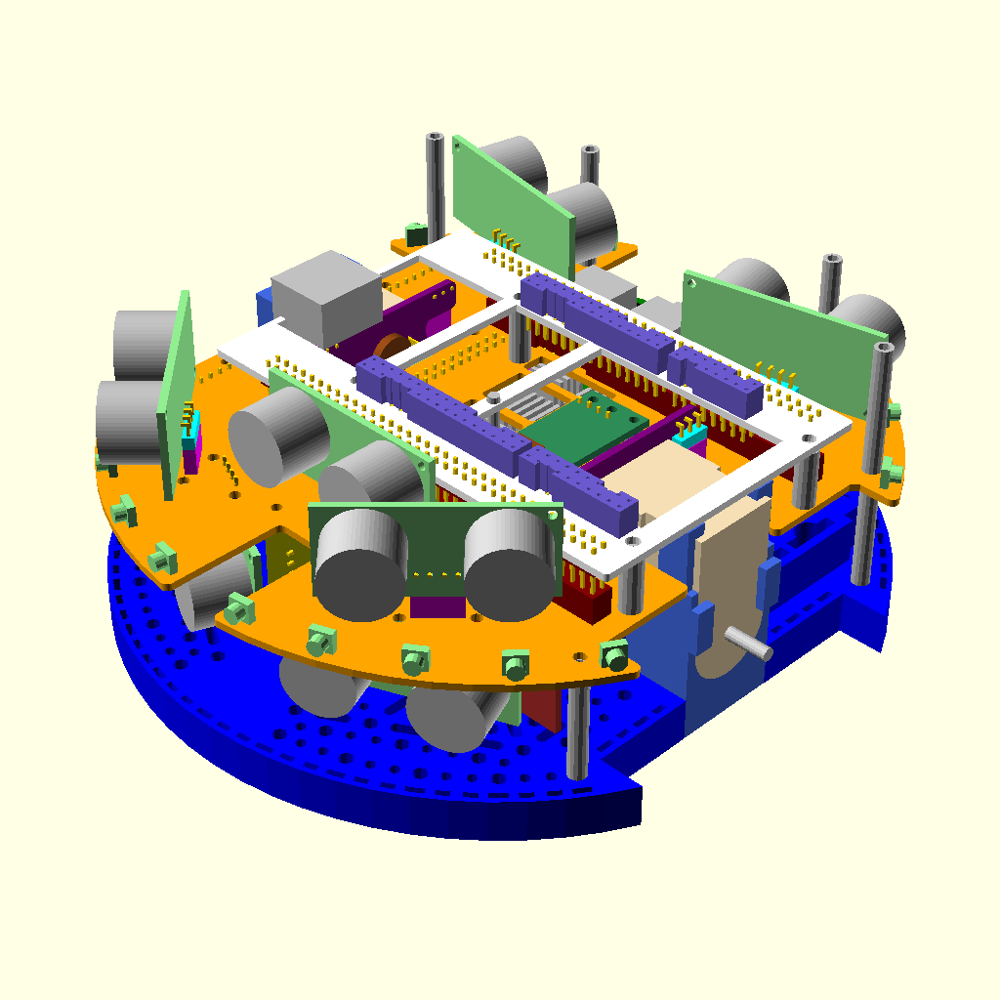

# HBRC ROS Robot Platform

The HBRC ROS Robot platform (ie. HR2 or just plain HR2) is a
pedagogical robotic platform for teaching various robotics skills.

This top level document is broken into the following sections below:

* [Google Group](#google-group):
  The Google Group mailing list for this project.

* [Goals/Requirements](#goalsrequirements):
  The goals and requirements for the project.

* [Mechanical](#mechanical):
  The mechanical engineering aspects of the project.

* [Electrical](#electrical):
  The electrical engineering aspects of the project.

* [Software](#software):
  The software engineering aspects of the project.

* [Education](#education):
  The education components of the pproject.

* [Download/Installation](#downloadinstallation):
  The download and installation portions of the project.

## Google Group

There is a Google Groups mailing list to discuss this project at
[HbrcRosRobotPlatform@GoogleGroups.Com](mailto:HbrcRosRobotPlatform@GoogleGroups.Com).
To join the group, visit the
[HBRC ROS Robot Platform web page](https://groups.google.com/d/forum/hbrcrosrobotplatform)
(i.e. `https://groups.google.com/d/forum/hbrcrosrobotplatform`) and request to join.
If that does not work, squirt a quick message to the group manager
(`Wayne` AT_SIGN `Gramlich` PERIOD `Net`) requesting an invitation to join the group.

Not all traffic on the group is going to be interesting to everybody else.
To help out with filtering please put one of the following prefixes at the
front of the each subject line:

* `ALL:` A message of interest to everybody.
* `INST:` A message concerning software installation.
* `ME:` A message to people interested in the HR2 Mechanical Engineering 
  (i.e. solid modeling.)
* `EE:` A message to people interested in the HR2 Electrical Engineering
  (i.e. PCB design, manufacture, bring-up, testing, etc.)
* `SE:` A message to people interested in the HR2 Software Engineering
  (i.e. programs, firmware, etc.)
* `ED:` A message to people interested in the HR2 course materials.
* `DL:` A message concerning downloading and installation.
* `MSC:` A miscellaneous message that does not really fit any of the above
  protocols.

That should be enough group mailing list structure for starters.

## Goals/Requirements

The list below summarizes the some of the design choices that have been
made so far.

* Start with the Pololu Romi platform used by FPGA class. [Decided]
* Use Patrick's PCB breakout board as a starting point. [Done]
* Consider ditching the Pololu motor board. [Done]
* Work hard to see if the Pololu arm can be bolted on. [Very Likely]
* Try to use USB battery pack instead of AA batteries. [USB Pack yes; AA's no]
* Provide support RasPi 3B+ and RasP4: [yes]
  * 40-pin connector.
  * I2C EEPROM for "hat" identification.
  * Real Time Clock needed for ROS.
  * Various RasPi I2C, SPI, GPO, Serial lines made available.
    *  [Serial: yes, I2C: yes, SPI: probably not, GPIO: OS shutdown
* Some sort of MPU on board:
  * Off the shelf microcontroller board [STM Nucleo-144 Dev. Board format selected]
  * Roomy enough to run MicroPython/MicroROS [STM NUCLEO-F767ZI nominal]
    * ~$25, 216MHz, 2MB Flash, 512K RAM, timers, UARTs, I2C, SPI, Ethernet, etc.
  * Must support C/C++ debugging [ST-Link].
  * Ethernet Phy to talk to boards other than RasPi [Yes]
* FPGA support [custom daughter board required.]
* Arduino support [AVR Dropped. AVR's are expensive/under powered]
* Expansion Capabilities:
  * Arduino Shields. [One can be plugged onto Nucleo.]
  * MikroBus [Iffy, space is tight]
  * Demand Peripherals Connector(s): [On FPGA daughter boards only]
  * Wayne's Bus? [Iffy, space is tight; ouch this hurts!]
  * Grove connectors [Very Likely]
  * Pololu power supply sockets [Iffy, space is tight.]
* Sensors:
  * Motor encoders. [Yes, 1440 step/rev.]
  * Various edge sensors for table top challenge, maze follower, etc.
  * Edge sensors (TOF, IR)
  * Sonars, the are cheap [5 in front, 4 in back.]
  * Servos (arm, camera tilt) [Minimum 4 required]
  * Inexpensive Lidar [Only if the platform is not overloaded]
    * YLidar X2 (~$70)
    * RPLdar A1M8 (~$100)
  * E-Stop [Probably not]
* Camera [RasPi Camera]
* Misc:
  * What issues are missing?

### Mechanical

The mechanical issues are worked out in greater detail in the
[mechancial directory](mechanical/README.md).

The mechanical tasks are:

* Model the Romi platform in OpenSCAD to ensure that the PCB outline
  and mounting holes are correct.
* Model the Romi arm in OpenSCAD to make sure that the Arm does not
  interfere with anything.
* Model both a RasPi 3B+ and RasPi4 for attaching to PCB.
* Model the basic PCB outlines, connector placements, etc.

A short summary of the mechanical design decisions to date are:

* Use the Pololu Romi Platform.
* Use an alternate layout of the motor encoder PCB to free up space to
  support some SBC (Single Board Computers) that are larger than the
  Raspberry Pi footprint.
* Design master board to use an STM Nucleo-144 development board for the
  processor.  All H-bridges, power management, to be put on one board.
* FPGA boards to be done with a a daughter board that plugs into Nucleo-144 board.
 
## Electrical

The electrical issues are worked out in greater detail in the
[electrical directory](electrical/README.md).

Some brief comments on the electrical aspects are:

* The design is to be done using KiCad, since KiCad is 100% free.
* It would be nice to be able to use a simple two layer PCB.
* It would be nice to be able to take power from a USB Power pack.
* It would be nice to support daughter boards for FPGA's.

The overall strategy is to prototype everything using the
[Bantum Labs PCB Milling Machine](https://www.bantamtools.com/)
over at [OLogic](http://www.ologicinc.com/).  This machine is
constrained to only prototyping boards that are 4 inches by 5 inches.
Once the electronics are debugged and working, the PCB's will be
sent out to an appropriate PCB Manufacturing house.

### Software

This section is pretty brief for the moment...

The software issues are worked out in greater detail in the
[software directory](software/README.md).

Terminology:

* Single Board Computer (SBC):
  The nominal SBC for the platform is either the RasPi 3B+
  or the RasPi 4.  Other boards that are compatible with the RasPi
  pin-out *can* be supported, but somebody will have to step up to
  the task of doing the actual support.  The SBC resides on the robot.
* Micro-Processor Unit (MPU):
  This is the micro-controller that is on the main board.
  The nominal processor is ST32Fxxx, where xxx is to be decided.
  The MPU resides on the robot.
* Robot Processors: The robot processors are the SBC and the MPU.
* Development Processor: The development processor is not physically
  attached to the robot.  Instead, it communicates with the robot SBC
  via WiFi.

The software goals are:

* The platform runs ROS on the SBC.
  * Both ROS 1 and ROS 2 are goals with ROS 1 eventually being
    deprecated.
* We need to be able download firmware into the MPU from the SBC.
  This needs to be hands off.
  * Custom C/C++ drivers.
  * MicroPython.
  * Micro ROS.
* The development processor needs to be able to debug code
  running on the robot:
  * Debugging ROS nodes running on the SBC should be relatively easy.
  * Debugging C/C++ code running on the MPU is going to need JTAG
    support.  This can be done with a JTAG chip like the FTDI FT2232.
    This *may* be an "add-on".  OpenOCD can talk to this JTAG chip
    and `gdb` can talk to openocd.
  * Debugging MicroPython is tough.  It currently supports breakpoints
    but does not support data/stack inspection (yet!)
  * As a total stretch, it would be nice to support ARM ETM CoreSight.
    This requires a seriously expensive brick that weighs a ton.
    It is probably a fantasy.
* We need to support FPGA development:
  * We need to be able to download the FPGA chip from the SBC.
  * The FPGA compliation stack needs to run on the SBC and the development
    processor.

## Education

This section is more of a place holder for now...

A partial list of possible educational classes for HR2 platform are:

* Low level robot peripheral drivers.
  * C/C++
  * Micropython
* ROS driver development
  * C/C++
  * Python
* More generic ROS Programming
* Image processing with OpenCV
* AI Frameworks
* Arm manipulation
* PCB design
* MCAD design
  * OpenSCAD
  * Fusion 360
  * FreeCAD
* FPGA class
* Soldering Skills
  * Basic Through Hole
  * Surface Mount
* Rapid PCB prototyping w/Bantum Labs
* etc.

## Download/Installation

For now, this system can only be installed on a Ubuntu based Linux distribution.
Over time, this restriction can be relaxed, but for now it is Ubuntu based only.
What this means is that if you are running Window, MacOS, or some non-Ubuntu flavor
of Linux (Red Hat, Mint, Arch, etc.) you will need to download some virtualization
software (like Oracle `virtualbox`), install a Ubuntu linux, and run from there.
Furthermore, this script has only been tested on Ubuntu 18.04.  It should work
on new versions (18.10, 19.04, 19.10 and probably the upcomeing 20.04), but issues
may crop up.  As issues crop up, please send the issues to the group mailing list
so they can be fixed.  Alternatively, fix the problems yourself use the `github.com`
pull request workflow and submit pull requests.

The software is generally deployed in three broad catagories:

* Ubuntu packages: for basic tools and software (e.g. Kicad, OpenSCAD, etc.)
* Cloned Git Repositories: this project and some projects it depends upon used
  `git` repositories.
* Python `pip` packages: There is lots of Python 3 code sprinkled around this project
  and a bunch of it is packaged up as Python packages that can be installed with
  the Python `pip` program.  (By the way, `pip` stands for `Pip Installs Packages`.)
  There is heavy use of a technology called Python Virtual Environments.

There will be a number of cloned git repositories and they need to reside as
separate sub-directories under one parent repository directory.  (One parent
directory to rule them all!)  You can call this parent directory whatever you
want -- `repos`, `projects`, `funstuff`, `sauron`, etc.  For the directions
below we use `REPOS` for this parent directory name.  Please substitute the
directory name you picked for `REPOS` in the directions below:

There are 3 broad steps:

1. The first step is to clone the `hbrc_ros_robot_platform` repository.
   There are two ways of doing this -- a direct clone form `github.com` or an
   indirect clone from `github.com`.  Beginners should do the direct clone
   instuctions immediately below and `github.com` experts should modify the
   instructions below for the indirect clone.  Let's get going:

        cd .../REPOS   # Change the current working directory to REPOS
        # We need to get `git` installed.
        # If `git` is already installed, skip the install below:
        sudo apt get install git
        # Now "clone" the `hbrc_ros_robot_platform` repository using `git`:
        # This will probably prompt for your root password...
        # Type in your root password if when asked..
        git clone https://github.com/hbrobotics/hbrc_ros_robot_platform.git
        # Change the current working directory to the root of the cloned repository
        cd hbrc_ros_robot_platform
    
2. The second step is to run one or more installation scripts.  There are currently
   three scripts:

   * `mechancical/install_me.sh`:
     This script resides in the `mechanical` sub-directory and will install everything
     needed for the mechanical aspects of the project:

          ./mechanical/install_me.sh  # Install the mechanical portion of the project.

   * `electrical/install_ee.sh`:
     This script resides in the `electrical` sub-directory and will install everything
     needed for the mechanical aspects of the project.

          `./electrical/install_ee.sh  # Install the electrical portion of this project.`

   * `install_all.sh`:
     This script just installs everything.

          `./install.sh  # Install everything.`
     
3. There are a bunch of `Makefile`'s sprinkled through out the various
   sub directories in the project.  The `make` program can recursively visit each
   of these `Makefile`'s and do any additonal needed steps.  There are two `make`
   targets in all `Makefile`'s:

   * `all`: This is the normal do day-to-day target that is used when you
     simply type `make`.
   * `everything`: This is meant to be used once since it does additional steps
     that are rarely needed -- create images, `dxf` files, etc.  This target
     is triggered by typing `make everything`.

4. There are two things left to do:

   A. Enable your python virtual environment:

           source ~/.bashrc   # Prepare for python virtual environments
           workon hr2         # Enable the hr2 virtual environment

   B. Use the `make` program to recursively build `everything` by typing:

           make everything

   For the first time through, we use the `everything` target:

        make `everything`  # Force everything to be recursively made.

Installing is a notoriously fragile process and it is quite possible that
something can go wrong.  If so, please send a message to the group list with
the `DL:` prefix on the subject line explaining the issue so it can be resolved.

