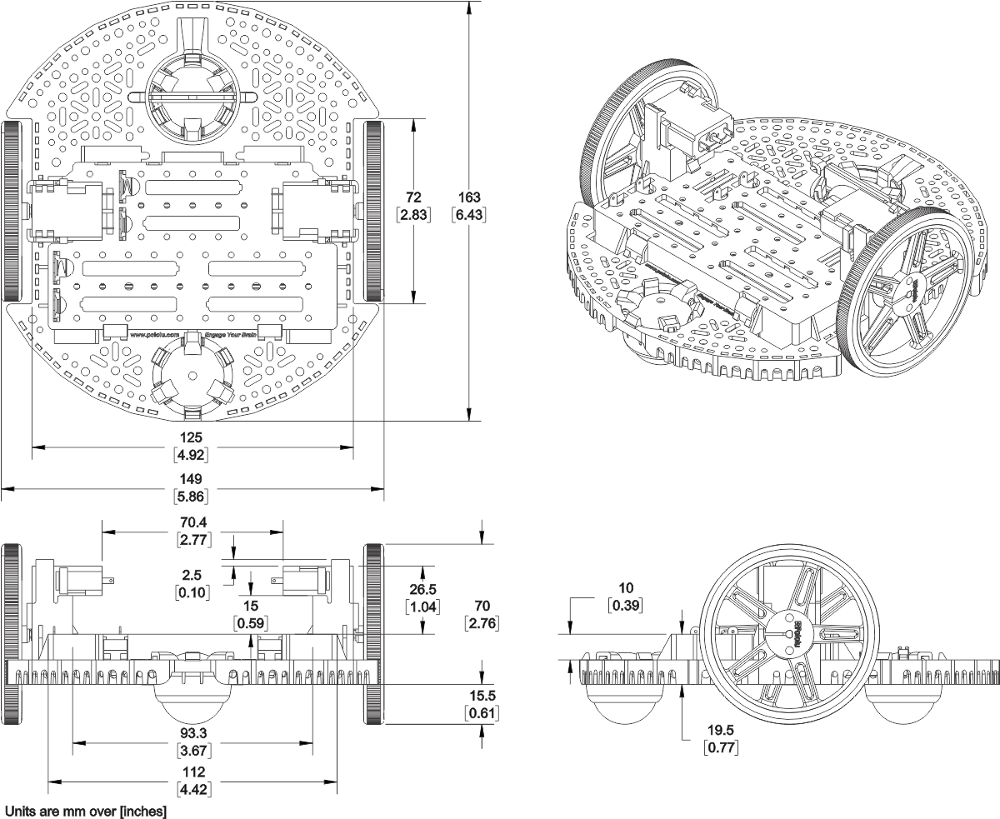
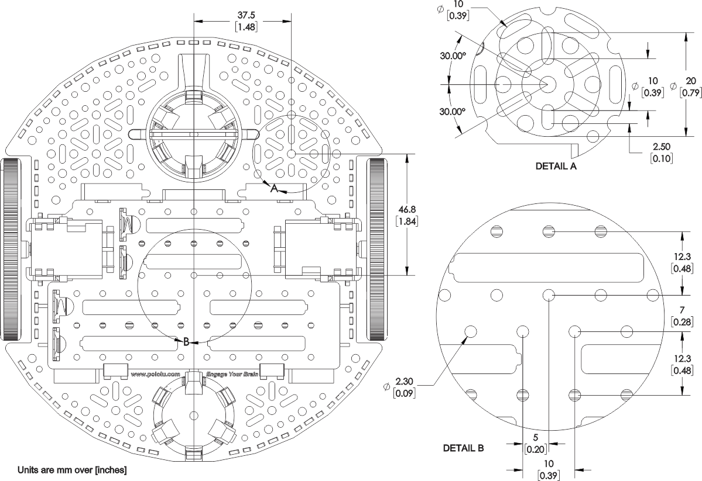

# HBRC ROS Robot Mechanical Issues

## Installation and Use

The instructions below for Ubuntu based distributions.  For all other operating
systems and Linux distributions you are on your own.

* Download clone the repository:

            # cd .../somwhere  # Something like `~/Downloads` should work
            git clone https://github.com/hbrobotics/hbrc_ros_robot_platform.git

* Install Python Virtual Envoronments:

  * Read about
    [Python Virtual Envionrments](https://realpython.com/python-virtual-environments-a-primer/).
    The URL is `https://realpython.com/python-virtual-environments-a-primer/`.  The
    important stuff is at the end of tutoral document.  Make sure you edit your
    `~/.bashrc` file as directed in the tutoral.

  * Setup a Python Virtual Environment:

            mkvirtualenv -a .../somewhere -p python3.6 hr2
            workon python hr2

* Install the required Python development tools:

            cd romi_model
            pip install -r develop.rec

* Install `openscad`, `convert` (i.e. ImageMagik), and `qcad`:

            sudo apt install openscad imagemagik qcad

* Build the `romi_base.scad` files:

            make
            scad_models

* Run `openscad` and run "[Design]=>[Preview]":

            openscad romi_base.scad

* That is as far as we have gotten so far.

## Documentation:

### Pololu Romi Documentation:

* [Pololu Romi Chasis User's Guide](https://www.pololu.com/docs/0J68/all):
  The Pololu Romi is mostly documented by there web site.  Alas, there is no
  `.pdf` version of the file, so if Pololu ever decides to take the User's
  Guide down, it will be *GONE*.

* Pololu Chasis `.dxf` files:
  There two `.dxf` files that can be loaded by programs that can read
  `.dxf` files (e.g. `qcad`, `inkscape`, etc.)  Using these files it is possible
  to tediously extract locations of edges, rectangles, holes, etc.  The two
  `.dxf` files proper are listed below, but they have been convert to `.png`
  files a little further below:
  * [mechanical/dxf/romi-chasis.dxf](dxf/romi-chasis.dxf):
    This is the top, front, side, and side views of the Romi Chasis.
  * [mechanical/dxf/romi-chasis-expansion-plate.dxf](dxf/romi-chasis-expansion-plate.dxf):
    This is the top, bottom, front, and side view of the Romi Chasis
    expansion plate.
  These files are copyrighted by Pololu and if Pololu requests that they be
  removed from this repository, the request will be honored immediately.

* PNG Files:
  There are 4 images that have been captured from the Pololu web site.
  Again, these are copyrighted and any removal request from Pololu
  will be immediately honored.  There are two images for the Romi Chasis
  and two images for the Romi expansion plate.

  The two Romi Chasis images are different from the two associated
  `.dxf` files above in that they contain some dimensions.  Both these
  files are in-lined:

  * `mechanical/png/Romi_Chasis_Dimensions.png`:

    

  * `mechanical/png/Romi_Chasis_Details.png`:

    

  There four Romi Expansion Chasis images that are derived from the two
  Romi Expansion Chasis `.pdf` files above:

  * `mechanical/png/romi-chasis-expansion-plate-dimensions-0.png`:

    

  * `mechanical/png/romi-chasis-expansion-plate-dimensions-1.png`:

    

  * `mechanical/png/romi-chasis-expansion-plate-dimensions-2.png`:

    

  * `mechanical/png/romi-chasis-expansion-plate-hole-alignment.png`:

    

